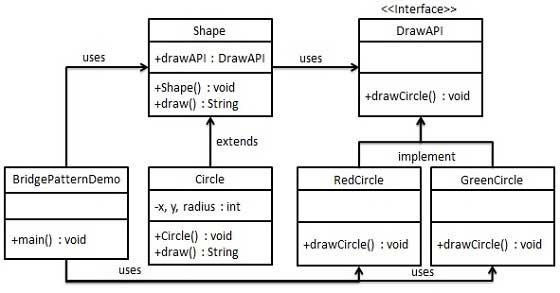

# Today I Learned

| 구분 | 내용                                          |
| ---- | --------------------------------------------- |
| DATE | 2023.12.26                                    |
| PART | 01. 생성자 대신 정적 팩터리 메서드를 고려하라 |

# 2장 객체 생성과 파괴

## Item01. 생성자 대신 정적 팩토리 메서드를 고려하라

- 클래스의 인스턴스를 얻는 전통적인 수단은 public 생성자이지만, 생성자와 별도로 정적 팩터리 메서드(`static factory method`)를 제공할 수 있다.
- `boolean` primitive type의 boxed class인 `Boolean`에서 발췌한 간단한 예를 보자.
  ```java
  public static Boolean valueOf(boolean b) {
    return b ? Boolean.TRUE : Boolean.FALSE;
  }
  ```

### 장점

1. 이름을 가질 수 있다.

- 생성자에 넘기는 매개변수와 생성자 자체만으로는 반환될 객체의 특성을 제대로 설명하지 못한다.<br>
  ex) 값이 소수인 BigInteger Return: `BigInteger(int, int, Random)` - `BigInteger.probablePrime`
- 여러 개의 `Signature`를 가진 생성자를 만들 수 있다.

2. 호출될 때마다 인스턴스를 새로 생성하지 않아도 된다.

- `immutable class`는 인스턴스를 미리 만들어 놓거나 새로 생성한 인스턴스를 캐싱하여 재활용하는 식으로 불필요한 객체 생성을 피할 수 있다.<br>
  특히 생성 비용이 큰 같은 객체가 자주 요청되는 상황이라면 성능 향상에 큰 도움이 된다.
  ex) `Boolean.valueOf(boolean)`: 객체를 아예 생성하지 않는다.
- 언제, 어느 인스턴스를 살아 있게 할지 철저히 통제 가능하다: `instance-controlled class`. 통제하는 이유는? `singleton`, `noninstantiable`한 `class`로 만들 수 있다. 또한 `immutable value class`에서 동치인 인스턴스가 단 하나뿐임을 보장할 수 있다. 인스턴스 통제는 플라이웨이트 패턴의 근간이 된다.
- enum type은 인스턴스가 하나만 만들어짐을 보장한다.

3. 반환 타입의 하위 타입 객체를 반환할 수 있는 능력이 있다

- 반환할 객체의 클래스를 자유롭게 선택할 수 있게 하는 유연성이 높아진다.
- 인터페이스를 정적 패터리 메서드의 반환타입으로 사용하는 인터페이스 기반 프레임워크를 만드는 핵심 기술
- ex) `java.util.Collections`
  - java 8 이전: interface 내 static method 선언 불가 -> `Collections`라는 `companion class`(동반 클래스)를 만들어 정의
    - `Types`: 이름이 `Type`인 인터페이스를 반환하는 정적 메서드가 필요할 때
    - client는 구현 클래스가 아닌 interface만으로 다루게 되므로 일반적으로 좋은 습관
  - java 8 이후: interface 내 static method 선언 가능 -> 인스턴스화 불가 `companion class`를 둘 이유가 별로 없음. 그 `public static` 멤버들 상당수를 인터페이스 자체에 두면 됨. 단, `package-private` 클래스에 두어야 할 수도 있음. `public`만 허용하기 때문. (java 9 이상은 `private` 가능하나, 정적 필드와 정 멤버 클래스는 `public`)
    - ex) `List.of()`

4. `input parameter`에 따라 매번 다른 클래스의 객체 반환 가능

- return type의 하위 타입이기만 하면 어떤 클래스의 객체를 반환하든 상관없다.
- ex) `EnumSet`: public 생성자 없이 오직 정적 팩터리만 제공한다.

  - 원소가 64개 이하면 원소들을 `long` 변수 하나로 관리하는 `RegularEnumSet` instance, 65개 이상이면 `long` 배열로 관리하는 `JumboEnumSet` instance 반환

    - 클라이언트는 이 두 클래스의 존재를 모른다. 알 필요도 없다. 성능 개선을 위해 다음 릴리즈에서는 하나를 삭제해도 문제가 없다.

    ```java
    public static <E extends Enum<E>> EnumSet<E> noneOf(Class<E> elementType) {
      Enum<?>[] universe = getUniverse(elementType);
      if (universe == null)
          throw new ClassCastException(elementType + " not an enum");

      if (universe.length <= 64)
          return new RegularEnumSet<>(elementType, universe);
      else
          return new JumboEnumSet<>(elementType, universe);
    }
    ```

5. 정적 팩터리 메서드를 작성하는 시점에는 반환할 객체의 클래스가 존재하지 않아도 된다.

- 유연함 - `service provider framework`를 만드는 근간이 된다. ex) `JDBC(Java Database Connectivity)`
  - `service provider framework` 핵심 컴포넌트 3가지 + a
    - `service interface`: 서비스의 인터페이스
    - `provider registration API`: 제공자가 구현체 등록 시 사용하는 제공자 등록 API
    - `service access API`: 서비스의 인스턴스를 얻을 때 사용하는 서비스 접근 API
    - `service provider interface`: 서비스 인터페이스의 인스턴스를 생성하는 팩터리 객체를 설명, 종종 사용됨. 이게 없다면 각 구현체를 인스턴스로 만들 때 리플렉션을 사용해야 된다.
    - ex) JDBC
      - `Connection`: service interface
      - `DriverManager.registerDriver`: provider registration API
      - `DriverManager.getConnection`: service access API
      - `Driver`: service provider interface
  - `service provider framework`
    - 클라이언트는 `service access API`를 사용할 때 원하는 구현체의 조건을 명시할 수 있고, 명시하지 않으면 기본 구현체 혹은 지원하는 구현체들을 하나씩 돌아가며 반환한다. 이 서비스 접근 API가 바로 서비스 제공자 프레임워크의 근간이라고 한 유연한 정적 팩터리의 실체다.
  - `service provider framework`의 변형
    - 서비스 접근 API는 공급자가 제공하는 것보다 더 풍부한 서비스 인터페이스를 클라이언트에 반환할 수 있다: `Bridge pattern`
      - 예를 들어, JDBC는 `Connection` service interface를 제공하는데 MySQL, MS SQL Server 등에서는 각 데이터베이스에 맞는 추가적인 특화 기능을 제공할 수 있다. (다만, 강제 형변환이 필요하거나 등 각 구현체의 기능에 종속될 수 있으므로 결합도가 높아질 수 있음에 유의한다.)
        - `DriverManager.getConnection(Clazz)`는 왜 제공되지 않을까? 각 데이터베이스간 호환성에 중점을 두므로 각 구현체를 명시적으로 호출하는 이러한 API는 추상화 원칙에 적합하지 않을 수 있다.
        - `Bridge Pattern`<br>
          [](https://www.tutorialspoint.com/design_pattern/bridge_pattern.htm)
    - `java.util.ServiceLoader`: 자바 5부터 제공
      - java의 `ServiceLoader` 프레임워크는 서비스 인터페이스를 정의하고, 구현체를 생성한 후 `META-INF/services/com.example.XXXService` 등에 구현 클래스들을 작성해두면 서비스 제공자들을 로드하고 사용할 수 있게 해준다. (https://docs.oracle.com/javase%2F9%2Fdocs%2Fapi%2F%2F/java/util/ServiceLoader.html)

### 단점
1. 상속을 하려면 public / protected 생성자가 필요하니 정적 팩터리 메서드만 제공하면 하위 클래스를 만들 수 없다. 
* ex) `java.util.Collections`: 이와 같은 유틸리티 구현 클래스들은 상속할 수 없다. 어떻게 보면 상속보다 컴포지션을 사용하도록 유도하고, 불변 타입으로 만들기 위해서는 이 제약을 지켜야 한다는 점에서 오히려 장점이 될 수 있다. 

2. 정적 팩터리 메서드는 프로그래머가 찾기 어렵다. 
* 생성자처럼 API 설명에 명확히 드러나지 않으니 사용자는 정적 팩터리 메서드 방식 클래스를 인스턴스화 할 방법을 알아내야 한다. 관련해서, API 문서를 잘 써놓고 메서드 이름도 널리 알려진 규약을 따라 짓는 식으로 완화할 수 있다. 

|규칙|설명|예시|
|:----|:----|:----|
|`from`|매개변수를 하나 받아서 해당 타입의 인스턴스를 반환하는 형변환 메서드|`Date d = Date.from(instant)`|
|`of`|여러 매개변수를 받아 적합한 타입의 인스턴스를 반환하는 집계 메서드|`Set<Rank> faceCards = EnumSet.of(JACK, QUEEN, KING)`|
|`valueOf`|from과 of의 더 자세한 버전|`BigInteger prime = BigInteger.valueOf(Integer.MAX_VALUE)`|
|`instance`\|`getInstance`|(매개변수를 받는다면) 매개변수로 명시한 인스턴스를 반환하지만 같은 인스턴스임을 보장하지는 않는다.|`StackWalker luke = StackWalker.getInstance(options);`|
|`create`\|`newInstance`|instance 혹은 getInstance와 같지만  매번 새로운 인스턴스를 생성해 반환함을 보장한다.|`Object newArray = Array.newInstance(classObject, arrayLen);`|
|`getType`| getInstance와 같으나 생성할 클래스가 아닌 다른 클래스에 팩터리 메서드를 정의할 때 쓴다. <i>"Type"</i>은 팩터리 메서드가 반환할 객체의 타입이다.|`FileStore fs = Files.getFileStore(path);`|
|`newType`|newInstance와 같으나 생성할 클래스가 아닌 다른 클래스에 팩터리 메서드를 정의할 때 쓴다. <i>"Type"</i>은 팩터리 메서드가 반환할 객체의 타입이다.|`BufferedReader br = Files.newBufferedReader(path);`|
|`type`|getType과 newType의 간결한 버전|`List<Complaint> litany = Collections.list(legacyLitany);`|

* `valueOf`와 `from`
  * `valueOf`: `valueOf`는 자바 초기 버전부터 사용되어 온 메서드로, 주로 기본 자료형의 값을 래퍼 타입의 객체로 변환할 때 사용된다. "값으로부터 객체를 얻는다."는 의미로 이해하면 된다. 단일 값으로 부터 객체를 생성하는 데 적합한 명칭이다. ex) `Integer.valueOf(int)`
  * `from`: 주로 같은 타입이나 유사한 타입의 객체를 다른 형태의 객체로 변환하는 데 사용된다. 여기서 중요한 것은 변환 과정이 단순한 포맷 변경이거나, 매우 직관적인 변환이라는 점이다. ex) `LocalDate.from(TempralAccessor);`
  * `valueFrom`이 더 유사해보이지 않나? 왜 `valueOf`일까? 자바 커뮤니티에서 이미 널리 받아들여진 명명 규칙이다. 관례적 컨벤션이기 때문에, 직관적으로 받아들이기에 `valueOf`가 더 분명하게 역할을 나타낸다.

* `Auto-boxing`과 `valueOf`
  * `Integer.valueOf(1);` 대신 `Integer num = 1;`를 사용해도 된다. 코드 간결성을 위해서는 오토 박싱을 사용하는데 성능상의 이슈가 있다면 직접 수행하는 것이 좋다. 관련해서, IntelliJ에서는 `Integer num = 1;`을 사용하라고 warning을 준다. 컴파일러가 자동으로 변환해주기 때문이다. 명시적 방식(Integer.valueOf)은 오토박싱 이전의 자바 버전(java 5 이전)에서 사용되던 방식이고, 성능 관련 이슈가 없다면 더 간결하고 가독성 높은 코드를 작성하기 위함인 것으로 보인다.


## One more thing...
Spring framework를 사용하다보니 ServiceLoader를 직접 사용해본 적은 없는데, 아래와 같이 구현할 수 있다.

- <b>`Service Interface`</b>

```java
public interface MessageService {
  void sendMessage(String message);
}
```

- <b>`Provider`</b>

```java
public class EmailService implements MessageService {
  @Override
  public void sendMessage(final String message) {
    System.out.println("Sending Email: " + message);
  }
}

public class SmsService implements MessageService {
  @Override
  public void sendMessage(final String message) {
    System.out.println("Sending SMS: " + message);
  }
}
```

- <b>`META-INF/services/com.example.MessageService`</b>

```
com.example.EmailService
com.example.SMSService
```

- <b>`ServiceLoader`</b>

```java
public static void main(String[] args) {
  ServiceLoader<MessageService> services = ServiceLoader.load(MessageService.class);

  for (MessageService service : services) {
    service.sendMessage("Hello world");
  }

  // java 9 ~
  services.stream()
    .map(ServiceLoader.Provider::get)
    .forEach(service -> service.sendMessage("Hello world!"));
}
```

쉽게 플러그인을 사용할 수 있게 해주는 것은 좋지만 다만, 이렇게 meta 파일로 관리하게 되면 규모가 커질 수록 관리하기 어려워질 것 같단 생각이 들었다. 무엇보다 POJO로 관리할 수 있다면, 선언적으로, 명시적으로 java 코드로 알 수 있으면 좋겠단 생각 말이다. Spring framework도 수많은 xml 파일로 관리되다 점차 선언적으로 바뀌었으며 컴파일 시점에 빠르게 에러를 뱉어주기도 한다. 

관련해서 java 9의 모듈 시스템을 사용하면 모듈의 의존성과 서비스 제공자를 명시적으로 선언할 수 있다. 

- <b>`module-info.java`</b>
```java
module message.service {
  exports com.example.message;
}
```

```java
module email.service {
  requires message.service;
  provides com.example.message.MessageService with com.example.email.EmailService;
}
```

```java
module message.client {
  requires message.service;
  uses com.example.message.MessageService;
}
```
